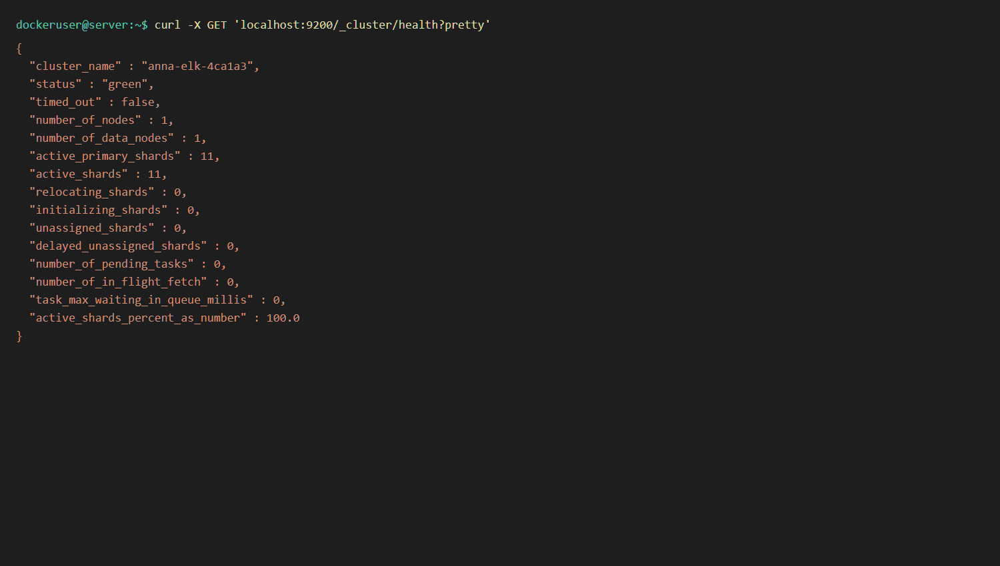
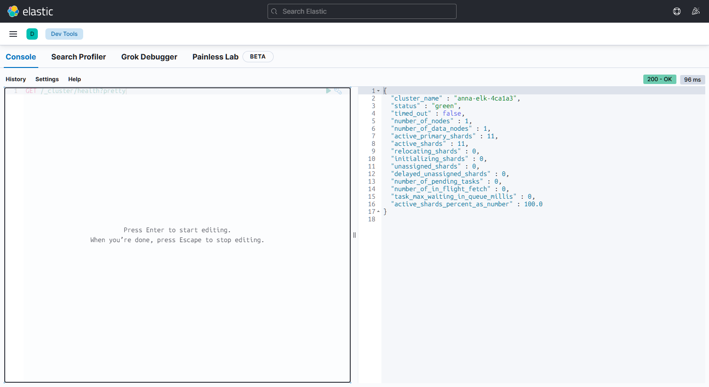
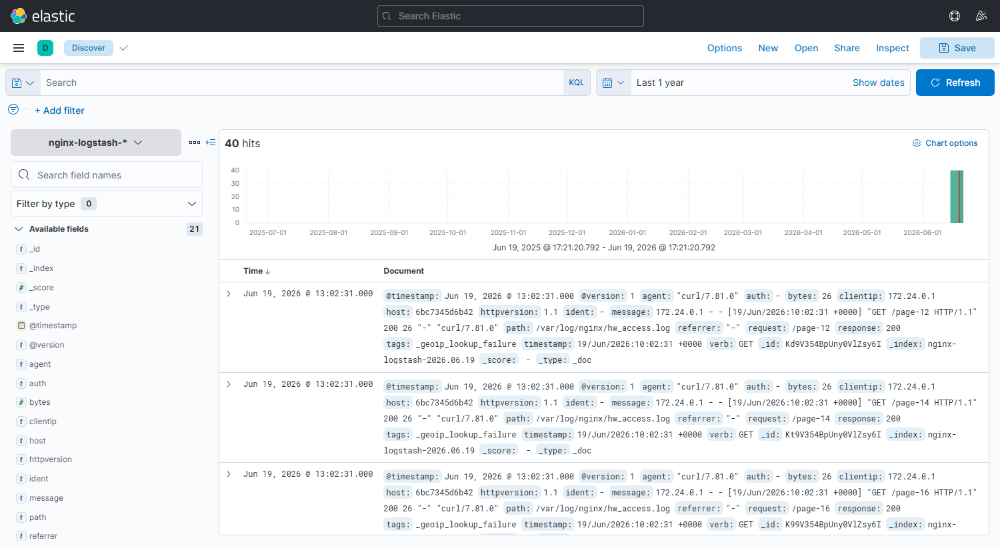
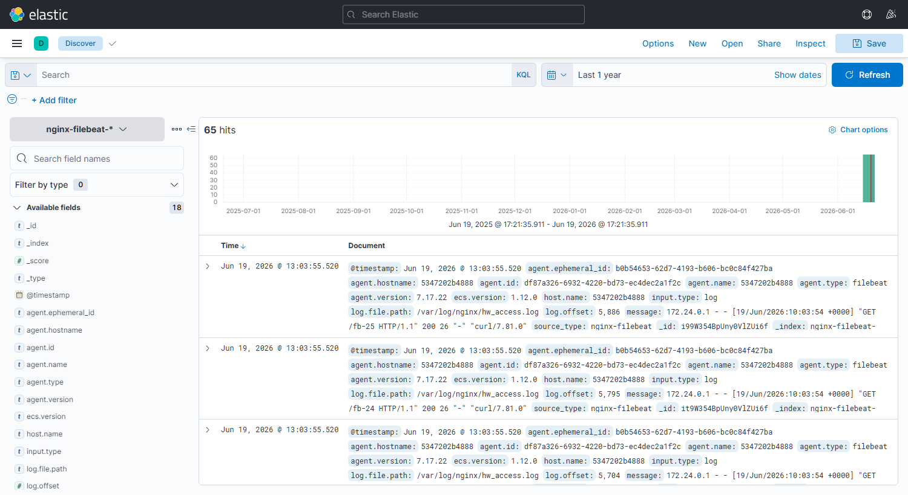

# Занятие: ELK Stack (Elasticsearch, Kibana, Logstash, Filebeat)

**Студент:** Анна Смага  <!-- TODO: впиши свои фамилию и имя -->

Домашнее задание: установить и настроить стек ELK, доставить access-логи Nginx
в Elasticsearch сначала через Logstash, затем через Filebeat.

> **Как запустить весь стек одной командой** (среда для воспроизведения):
> ```bash
> cp .env.example .env            # при желании поменяй CLUSTER_NAME
> docker compose up -d elasticsearch kibana nginx   # базовые сервисы
> ./scripts/gen_traffic.sh                          # создать трафик в логах
> ```
> Подробности по средам (Docker / нативная установка на сервере) — в [SETUP.md](SETUP.md).

> **✅ Развёрнуто и проверено на сервере** (Ubuntu 22.04, Docker Compose, стек 7.17.22):
> | Что | Значение |
> |---|---|
> | Имя кластера (`cluster_name`) | `anna-elk-4ca1a3` (случайное) |
> | Статус кластера | `green` |
> | Kibana | `http://<ip-сервера>:5601` |
> | Индекс Logstash | `nginx-logstash-2026.06.19` (40 docs) |
> | Индекс Filebeat | `nginx-filebeat-2026.06.19` (65 docs) |
>
> Осталось только снять 4 скриншота в браузере (см. отметки 📸 ниже) и вписать ФИО.

---

## Задание 1. Elasticsearch

Установить и запустить Elasticsearch, поменять `cluster_name` на случайный.
Привести скриншот команды `curl -X GET 'localhost:9200/_cluster/health?pretty'`
с нестандартным `cluster_name`.

### Решение

Случайное имя кластера задаётся через переменную `CLUSTER_NAME` (файл `.env`),
которая прокидывается в `cluster.name` Elasticsearch (см. `docker-compose.yml`).
Сгенерировать своё значение:

```bash
openssl rand -hex 4        # например: 7f3a9c2b
# вписать в .env -> CLUSTER_NAME=anna-elk-7f3a9c2b
docker compose up -d elasticsearch
```

Проверка здоровья кластера:

```bash
curl -X GET 'localhost:9200/_cluster/health?pretty'
```

Фактический вывод с сервера (виден нестандартный `cluster_name`):

```json
{
  "cluster_name" : "anna-elk-4ca1a3",
  "status" : "green",
  "timed_out" : false,
  "number_of_nodes" : 1,
  "number_of_data_nodes" : 1,
  "active_primary_shards" : 0,
  "active_shards" : 0,
  "active_shards_percent_as_number" : 100.0
}
```

**📸 Скриншот:** на сервере выполни `curl -X GET 'localhost:9200/_cluster/health?pretty'`
и сними скриншот терминала (виден `cluster_name: anna-elk-4ca1a3`).



---

## Задание 2. Kibana

Установить и запустить Kibana. Привести скриншот интерфейса Kibana на странице
`http://<ip>:5601/app/dev_tools#/console`, где выполнен запрос `GET /_cluster/health?pretty`.

### Решение

Kibana уже запущена на сервере. Открыть в браузере:

```
http://<ip-сервера>:5601/app/dev_tools#/console
```

В консоли Dev Tools выполнить и нажать ▶:

```
GET /_cluster/health?pretty
```

**📸 Скриншот:** интерфейс Dev Tools Console с запросом слева и ответом
`_cluster/health` справа (виден тот же `cluster_name`).



---

## Задание 3. Logstash

Установить и запустить Logstash и Nginx. С помощью Logstash отправить access-лог
Nginx в Elasticsearch. Привести скриншот Kibana, где видны логи Nginx.

### Решение

Pipeline Logstash (`logstash/pipeline/nginx.conf`): читает `/var/log/nginx/hw_access.log`,
парсит `COMBINEDAPACHELOG` через grok, пишет в индекс `nginx-logstash-*`.

```bash
docker compose --profile logstash up -d        # поднимет logstash
bash scripts/gen_traffic.sh                     # создать записи в hw_access.log
```

На сервере уже создан индекс **`nginx-logstash-2026.06.19`** (40 документов,
поля распарсены grok: `verb`, `request`, `response`, `clientip`).

В Kibana: **Stack Management → Data Views → Create data view** → name `nginx-logstash`,
index pattern `nginx-logstash-*`, time field `@timestamp` → **Discover**.

**📸 Скриншот:** Discover с логами Nginx из `nginx-logstash-*`.



---

## Задание 4. Filebeat

Установить и запустить Filebeat. Переключить поставку логов Nginx с Logstash на
Filebeat. Привести скриншот Kibana с логами Nginx, отправленными через Filebeat.

### Решение

Сначала отключаем доставку через Logstash, затем поднимаем Filebeat
(`filebeat/filebeat.yml`), который пишет в индекс `nginx-filebeat-*`:

```bash
docker compose stop logstash                    # выключаем Logstash
docker compose --profile filebeat up -d         # включаем Filebeat
bash scripts/gen_traffic.sh                      # новый трафик
```

На сервере уже создан индекс **`nginx-filebeat-2026.06.19`** (65 документов,
`source_type: nginx-filebeat`, сырые строки в поле `message`).

В Kibana: **Data Views → Create data view** → name `nginx-filebeat`,
index pattern `nginx-filebeat-*`, time field `@timestamp` → **Discover**.

**📸 Скриншот:** Discover с логами Nginx из `nginx-filebeat-*`.



---


## Структура репозитория

```
.
├── README.md                 # это решение (заполнить + скриншоты)
├── SETUP.md                  # как поднять стек (Docker / нативно на сервере)
├── docker-compose.yml        # ELK 7.17 + Nginx, профили logstash/filebeat
├── .env.example              # STACK_VERSION, CLUSTER_NAME
├── elk/                      # (резерв под доп. конфиги es/kibana)
├── nginx/conf.d/default.conf # лог-формат и сайт Nginx
├── logstash/pipeline/nginx.conf
├── filebeat/filebeat.yml
├── scripts/
│   ├── gen_traffic.sh        # генератор трафика на Nginx
│   ├── install_native_ubuntu.sh  # нативная установка apt (для сервера)
│   └── teardown.sh           # полный снос стека + освобождение диска
└── docs/screenshots/         # сюда класть скриншоты
```
